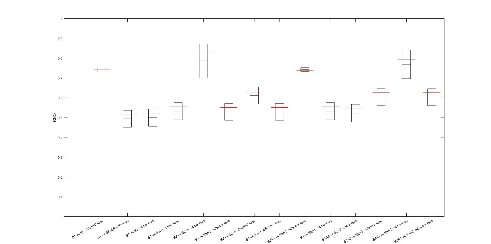

                           RHO (projected on sub 2, 3, and 4, respectively)
                  
    CONN   |            NOvsNO                    NOvsPRJ                   PRJvsPRJ
           |
    PLV    |    [74.35, 74.61, 72.76]      [55.46, 55.09, 47.95]     [73.55, 73.69, 75.30]
           |
    AEC    |    [70.89, 68.72, 66.16]      [52.52, 49.72, 44.62]     [66.20, 70.42, 73.38]
           |
    CORR   |    [75.74, 75.27, 74.38]      [53.64, 52.78, 46.40]     [74.89, 75.70, 77.49]
           |
    COH    |    [96.15, 95.74, 95.48]      [81.57, 81.68, 72.22]     [95.22, 95.99, 95.98]
           |
    AECo   |    [12.75, 9.50, 14.48]        [5.81, 3.20, 7.21]       [11.52, 19.14, 9.67]
           |
    MutInf |    [85.99, 84.96, 82.93]      [72.76, 70.44, 62.32]     [83.55, 84.56, 85.49]
           |
    PLI    |    [5.53, 5.43, 4.21]         [3.77, 3.11, 4.50]        [4.68, 4.85, 7.08]

Average results on the epochs 2-5 (the first is a bad epoch).

Figures are related to a subject 4, projecting on its anatomy and on subject 2's anatomy (however, all combinations similar pattern).

NO:  On normal anatomy (i.e., subject anatomy)
PRJ: Projected on another anatomy (PRJ1on2 means the first subject's data are projected on second subject's anatomy, PRJ2to1 the opposite, while PRJ1on3 and PRJ2on3 that data of the first and of the second subjects are projected on a third subject's anatomy, such as a default anatomy, in order to compare them).

RHO averaged between all the subjects except the one used as source subject in PRJ (eg., sub-A2003 and sub-A2004 when sub-A2002's anatomy is employed)

  

